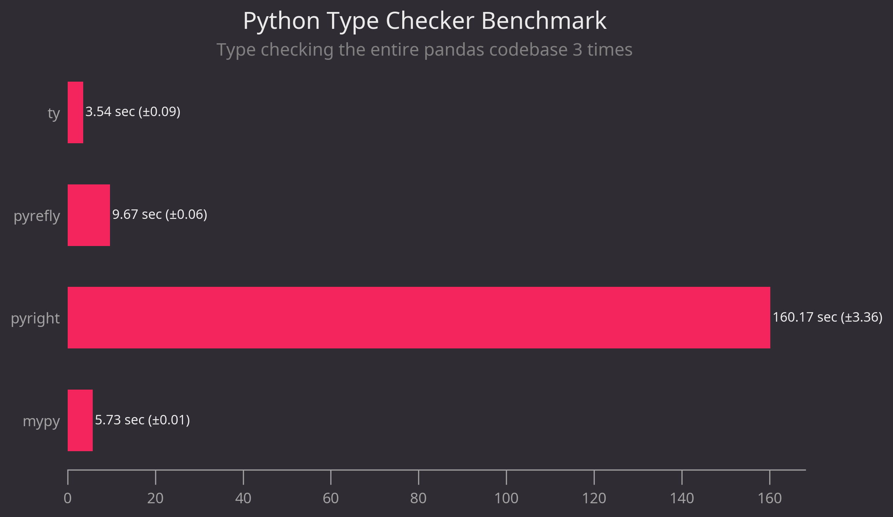

# Comparison of Python type checkers performance

How long does it take to type check the [pandas codebase](https://github.com/pandas-dev/pandas)?



This benchmark compares 4 Python type checkers

- [pyright](https://github.com/microsoft/pyright)
- [mypy](https://github.com/python/mypy)
- [pyrefly](https://github.com/facebook/pyrefly)
- [ty](https://github.com/astral-sh/ty)

<br>

## Run the benchmark

- Install type checkers & plotting dependencies (matplotlib + theme)

```bash
uv sync
```

- Run the benchmark (it will git clone the codebase locally first)

```bash
uv run benchmark.py
```
